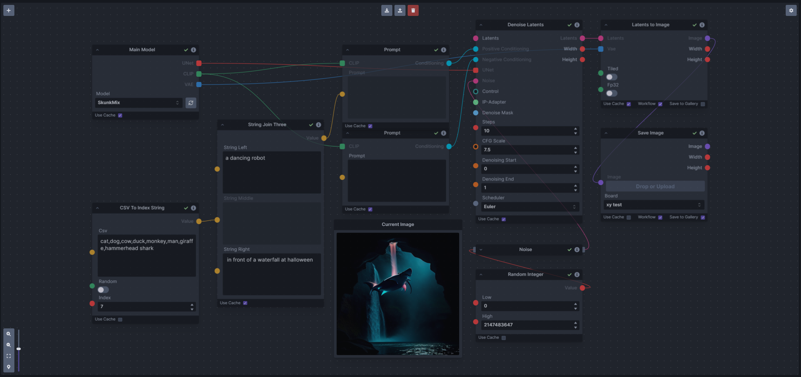

# `Prompt-Tools` nodes for InvokeAI
Discord Link :- [Prompt-Tools](https://discord.com/channels/1020123559063990373/1134084151386058803)

A set of InvokeAI nodes that add general prompt (string) manipulation tools.  Designed to accompany the PromptsFromFile node and other prompt generation nodes.

|Node|Description|
|---|---|
|`Prompt To File`|saves a prompt or collection of prompts to a file. one per line. There is an append/overwrite option|
|`PT Fields Collect`|Converts image generation fields into a JSON format string. Can be passed to Prompt To File for saving|
|`PT Fields Expand`|Takes JSON string and converts it to individual generation parameters. Can be fed from the Prompts From File node|
|`Prompt Strength`|Formats prompt with strength like the weighted format of compel|
|`Prompt Strength Combine`|Combines weighted prompts for .and()/.blend()|
|`CSV To Index String`|Gets a string from a CSV by index. Includes a Random index option|

The following Nodes are now included in v3.2 of Invoke (as part of [PR-#3964](https://github.com/invoke-ai/InvokeAI/pull/3964)). These have been removed from this set of tools.<br>
`Prompt Join` -> `String Join`<br>
`Prompt Join Three` -> `String Join Three`<br>
`Prompt Replace` -> `String Replace`<br>
`Prompt Split Neg` -> `String Split Neg`<br>

A backup of the v3.1.1 version remains in Discord: [messagelink-prompt_tools_311]([prompt_tools_311.py](https://discord.com/channels/1020123559063990373/1134084151386058803/1166313528114819132)).  **Warning** Do not use v3.1.1 and v3.4+ together as it will cause problems. 

## Usage
### <ins>Install</ins><BR>
There are two options to install the nodes:

1. **Recommended**: Use Git to clone the repo into the `invokeai/nodes` directory. This allows updating via `git pull`.

    - In the InvokeAI nodes folder, run:

        For Latest Invoke (4.0+):
        ```bash
        git clone https://github.com/skunkworxdark/prompt-tools.git
        ```
        For Invoke (3.5-3.7):
        ```bash
        git clone https://github.com/skunkworxdark/prompt-tools/tree/invoke-3.7
        ```

2. Manually download [prompt_tools.py](prompt_tools.py) & [__init__.py](__init__.py) then place them in a subfolder under `invokeai/nodes`. 

**Important:** If you have a previous version of these nodes (pre-Invoke 3.4) installed in the .env directory, delete the old `prompt_tools.py` to avoid errors. Workflows may need updating due to node changes.

### <ins>Update</ins><BR>
Run a `git pull` from the `prompt_tools` folder.

Or run `update.bat`(windows) or `update.sh`(Linux).

For manual installs, download and replace the files.

### <ins>Remove</ins><BR>
Delete the `prompt_tools` folder. Or rename it to `_prompt_tools`` so InvokeAI will ignore it.

## ToDo
- Test the new PTFields nodes
- Add validation to nodes generally.
- Support more fields like VAE, models etc.

## `Prompts To File`
Saves prompts to a file, append or overwrite.

Inputs:
- `Filepath` :  File to write. Created if doesn't exist. **Warning** Please be careful as there is no warning if a file already exists and will be overwritten.
- `Prompts` : Single prompt(string) or a collection
- `Append` : Defaults to append. Disabled to overwrite.

The workflow shows how you can use the `Collect` node to make a collection of prompts during an iterate process.  This node graph goes a step further and places the negative inside [] like the old v2 way of doing things but has the benefit of keeping it to one line per prompt.


## `PTFields Collect` and `PTFields Expand`
Note: Both of the PTfields nodes should be easy to change to add or remove fields if the ones provided are not correct.

`PTFields Collect` - Converts image generation fields into a JSON format string that can be passed to Prompt To File


`PTFields Expand` - Takes a JSON string and converts it to individual generation parameters


## `Prompt Strength` and `Prompt Strengths Combine`
`Prompt Strength` - Formats a prompt and strength into compel style weighted string. Multiples of these then can be fed into a collect node to create a collection of them and then used with the `Prompt Strengths Combine` node
```
e.g.
prompt: A blues sphere
strength: 1.2
output: (A blue sphere)1.2
```

`Prompt Strengths Combine` - Combines weighted prompts for `.and()`/`.blend()`.
```
e.g.
input: ["(cow)0.5","(Field)1.2","(stream)0.5"]
output: ("cow","Field","stream").and(0.5,1.2,0.5)
```


## CSV To Index String
`CSV To Index String` - Takes a CSV string and an index and outputs the string from the position index. If the index is out of range then it will wrap around. If the Random option is chosen the index will be chosen at random. 

This node could be used in conjunction with the `String Join` or `String Replace` nodes to build compound prompts. 

Or you could use it with a range node to step through the items in the CSV.  As the index wraps around you could use input from an external random node without worrying about the range.

```
Examples:
CSV: one,two,three,four
random:false
index: 0
output: one

CSV: one,two,three,four
random:false
index: 2
output: three

CSV: one,two,three,four
random:false
index: 4
output: one

CSV: one,two,three,four
random:true
index: 0
output: Random output from csv list

```


